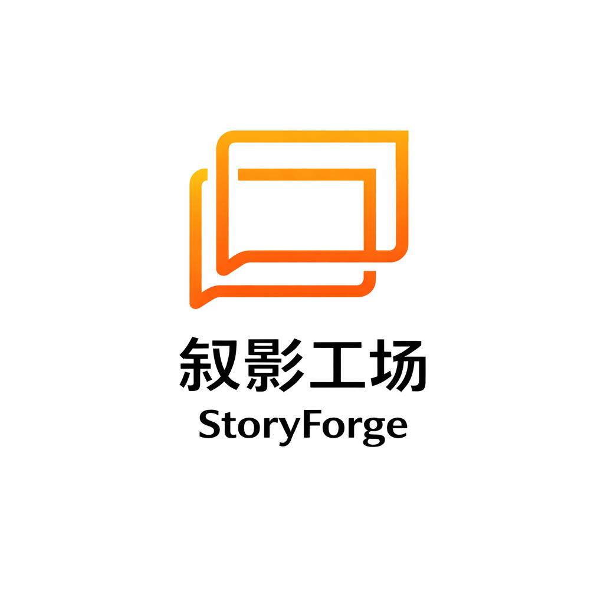

<h1 align="center">
  <br>
  <picture>
    <source media="(prefers-color-scheme: light)" srcset="frontend/public/frametale-logo.png">
    <source media="(prefers-color-scheme: dark)" srcset="frontend/public/frametale-logo.png">
    
  </picture>
  <br>
  Frametale
  <br>
</h1>

<h4 align="center">AI novel&video studio</h4>

<p align="center">
  <a href="README.md"></a>
  <a href="README.en.md"></a>
</p>

<p align="center">
  <a href="https://github.com/hongsir457/frametale/actions/workflows/docker.yml"></a>
  <a href="https://github.com/hongsir457/frametale"></a>
  <a href="https://github.com/hongsir457/frametale/blob/main/LICENSE"></a>
</p>

## Live Workspace

- Public URL: `https://bjmmuazhczom.cloud.sealos.io`
- Isolated namespace: `ns-qkcc8vj1`
- Public brand: `Frametale / 叙影工场`
- Internal compatibility identifier: `autovideo`

## Product Note

The public homepage and workspace are still evolving. This repository no longer embeds a static UI screenshot; refer to the current deployment for the latest interface.

## Core Capabilities

- End-to-end novel-to-video workflow in one workspace
- Novel Workbench for seed-to-manuscript generation and automatic project import
- Multi-model access through OpenRouter, Anthropic, and multiple image/video providers
- Multi-agent orchestration focused on narrative consistency and asset reuse
- Managed auth flows with registration, login, email verification, and password reset
- PostgreSQL-backed users, config, tasks, and usage tracking with Redis for async support
- Project ZIP import/export, CapCut draft export, and project-level media management

## First-Time Setup

After the stack is up, use this order:

1. Sign in with the bootstrap admin account
2. Open `/app/admin`
3. Configure a text model
   - Recommended: OpenRouter
   - Anthropic is also supported directly
4. Configure at least one image or video provider
5. Configure `SMTP_*` if you need real email delivery
6. Open `/app/novel-workbench` and launch your first novel job

## Quick Start

> Recommended platform: Linux, macOS, or Windows WSL2. Some Claude Agent SDK dependencies are not suitable for native Windows shells.

### Default deployment (SQLite)

```bash
git clone https://github.com/hongsir457/frametale.git
cd frametale/deploy
cp .env.example .env
docker compose up -d
```

Then open `http://localhost:1241`.

### Production deployment (PostgreSQL)

```bash
cd frametale/deploy/production
cp .env.example .env
```

At minimum, set:

```env
POSTGRES_PASSWORD=replace-me
AUTH_USERNAME=admin
AUTH_PASSWORD=replace-me
AUTH_EMAIL=admin@frametale.local
AUTH_TOKEN_SECRET=replace-me-with-a-long-random-secret
```

Then start:

```bash
docker compose up -d
```

To enable real email delivery for registration and password reset, also set:

```env
SMTP_HOST=
SMTP_PORT=587
SMTP_USERNAME=
SMTP_PASSWORD=
SMTP_FROM_EMAIL=
SMTP_FROM_NAME=Frametale
```

If you are still wiring mail later, use:

```env
AUTH_EMAIL_DEBUG=true
```

## Typical Workflow

1. Create a project in `/app/projects`, or import an existing ZIP
2. Open `/app/novel-workbench`, enter a title and seed, and launch the pipeline
3. Wait for drafting, revision, export, and automatic import back into the project
4. Continue with character art, clue assets, storyboards, grids, and video clips
5. Export the project ZIP or a CapCut draft

## Docs

- [docs/getting-started.md](docs/getting-started.md): full first-run guide
- [deploy/sealos/README.md](deploy/sealos/README.md): Sealos deployment notes
- [deploy/production/MIGRATE-TO-POSTGRES.md](deploy/production/MIGRATE-TO-POSTGRES.md): migrate from SQLite to PostgreSQL
- [docs/jianying-export-guide.md](docs/jianying-export-guide.md): CapCut draft export guide
- [CONTRIBUTING.md](CONTRIBUTING.md): local development and contribution workflow
- [CLAUDE.md](CLAUDE.md): repository map for coding agents

## License

[AGPL-3.0](LICENSE)
