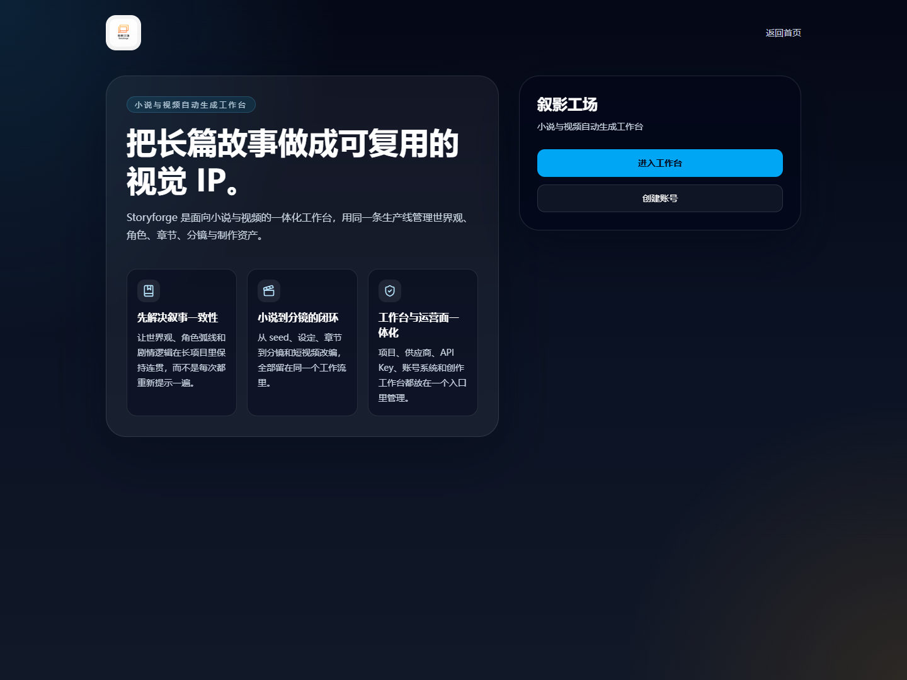

<h1 align="center">
  <br>
  <picture>
    <source media="(prefers-color-scheme: light)" srcset="frontend/public/storyforge-logo.png">
    <source media="(prefers-color-scheme: dark)" srcset="frontend/public/storyforge-logo.png">
    
  </picture>
  <br>
  Storyforge
  <br>
</h1>

<h4 align="center">叙影工场 · 小说与视频自动生成工作台</h4>

<p align="center">
  <a href="README.md"></a>
  <a href="README.en.md"></a>
</p>

<p align="center">
  <a href="https://github.com/hongsir457/storyforge/actions/workflows/docker.yml"></a>
  <a href="https://github.com/hongsir457/storyforge"></a>
  <a href="https://github.com/hongsir457/storyforge/blob/main/LICENSE"></a>
</p>

<p align="center">
  
</p>

---

## 在线工作台

- 公网地址：`https://bjmmuazhczom.cloud.sealos.io`
- 当前中文品牌展示：`叙影工场`
- 英文副标题：`AI novel&video studio`
- 当前独立运行命名空间：`ns-qkcc8vj1`

## 产品定位

Storyforge 面向“小说 -> 分镜 -> 视频”的一体化生产流程。它不是通用视频编辑器，而是一个围绕叙事一致性、角色资产复用和章节到视频改编的 AI 工作台。

## 品牌与内部标识

- 对外产品品牌始终是 `Storyforge / 叙影工场`
- 仓库内部兼容标识已经统一迁移为 `autovideo`
- 当前常见内部标识包括：
  - SQLite 文件：`projects/.autovideo.db`
  - 项目导出清单：`autovideo-export.json`
  - autonovel 导入脚本：`tools/import_autonovel_to_autovideo.py`
- 如果你在迁移旧数据、搜索日志、改脚本或检查导出包，请优先搜索 `autovideo`

## 当前生产架构

当前线上部署已经拆分为四个工作负载：

- `storyforge-frontend`：React 19 前端工作台
- `storyforge-backend`：FastAPI API、认证与项目服务
- `storyforge-postgres`：统一 PostgreSQL 关系型数据库
- `storyforge-redis`：缓存与异步任务支撑

Sealos 部署说明见 [deploy/sealos/README.md](deploy/sealos/README.md)。

## 账号体系

前端已经补齐完整托管账号流程：

- `/login`：登录
- `/register`：注册
- `/verify-email`：邮箱验证
- `/forgot-password`：忘记密码
- `/app/account`：资料修改、改密码、验证状态

管理员账号由环境变量初始化，普通用户统一写入 PostgreSQL。SMTP 配好后可真实发信；未配置 SMTP 时，可以通过 `AUTH_EMAIL_DEBUG=true` 把验证码与重置码打印到后端日志。

## 智能体与模型接入

`Storyforge Agent` 当前支持两条接入路径：

- Anthropic 官方 API
- OpenRouter Bearer Token

如果使用 OpenRouter，推荐在 `/app/settings`：

1. 填写 `OpenRouter API Key`
2. 点击 `应用 OpenRouter 预设`
3. 让 Anthropic 兼容代理地址自动指向 `https://openrouter.ai/api`

图像与视频仍需至少配置一个可用供应商：Gemini、火山方舟、Grok、OpenAI，或自定义兼容供应商。

## 快速开始

> 建议环境：Linux / macOS / Windows WSL2。Claude Agent SDK 及部分依赖不支持原生 Windows。

### 默认部署（SQLite）

```bash
git clone https://github.com/hongsir457/storyforge.git
cd storyforge/deploy
cp .env.example .env
docker compose up -d
```

启动后访问 `http://localhost:1241`。

### 生产部署（PostgreSQL）

```bash
cd storyforge/deploy/production
cp .env.example .env
# 设置 POSTGRES_PASSWORD 等必要环境变量
docker compose up -d
```

### 首次配置

1. 用 `admin` 登录
2. 打开 `/app/settings`
3. 为 `Storyforge Agent` 配置 Anthropic API Key 或 OpenRouter Token
4. 为图像/视频供应商配置至少一个可用 API Key
5. 如需邮件链路，补齐 SMTP 配置

## 使用流程

1. 在 `/app/projects` 创建项目，或导入已有项目 ZIP。
2. 上传小说源文件，让系统完成设定提取和项目概览生成。
3. 在 `/app/novel-workbench` 填写标题、Seed 文案、风格、画幅和默认时长，启动自动写小说流水线。
4. autonovel 跑完后，结果会自动导回 Storyforge 项目。
5. 进入项目后继续生成角色图、线索图、分镜图、宫格图和视频片段。
6. 如有需要，可导出项目 ZIP 或剪映草稿。

## 核心能力

- 小说到视频的完整工作流：项目、设定、分镜、视频、导出在同一工作台完成。
- 多智能体协作：基于 Claude Agent SDK 的主 Agent + 聚焦 Subagent 架构。
- OpenRouter 接入：支持用一把 OpenRouter key 路由 Claude、GPT、Gemini 等文本模型。
- 多供应商媒体生成：Gemini、火山方舟、Grok、OpenAI、自定义兼容供应商。
- 托管账号体系：注册、登录、邮箱验证、忘记密码、账号页已在线。
- PostgreSQL 统一存储：用户、配置、任务、用量等关系型数据都走 PostgreSQL。
- Redis 异步支撑：任务与缓存不再跟前后端混在单体容器里。
- 项目导入导出：支持 ZIP 打包与恢复。
- 剪映草稿导出：生成后可继续在剪映做二次剪辑。
- 费用追踪与预估：支持多供应商成本汇总。

## 相关文档

- [docs/getting-started.md](docs/getting-started.md)：从部署到跑通小说工坊的完整入门教程
- [deploy/sealos/README.md](deploy/sealos/README.md)：Sealos 四件套部署说明
- [deploy/production/MIGRATE-TO-POSTGRES.md](deploy/production/MIGRATE-TO-POSTGRES.md)：旧 SQLite 数据迁移到 PostgreSQL
- [docs/jianying-export-guide.md](docs/jianying-export-guide.md)：剪映草稿导出说明
- [CONTRIBUTING.md](CONTRIBUTING.md)：本地开发、测试与提交规范
- [CLAUDE.md](CLAUDE.md)：仓库结构与 agent 开发说明

## 贡献

欢迎提交 Issue、PR 和文档修正。开始之前请先阅读 [CONTRIBUTING.md](CONTRIBUTING.md)。

## 许可协议

[AGPL-3.0](LICENSE)
